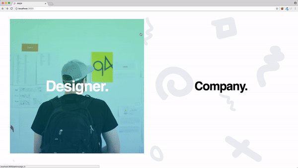

# jQuery-Front-End
Proposal.io - with jQuery Front End - Final Project for 'Using Rails with Javascript' Section.

## About this Application

Web Application built using Javascript and Ruby. Front End majorly consists of jQuery - as per requirements for final project.
This was made with the idea of providing a way to connect Freelancers and Clients, to agree on terms, and to simplify the overall process of Client/Freelancer Communication.

## Contributing

Please read [CONTRIBUTING.md](CONTRIBUTING.md) for details on our code of conduct, and the process for submitting pull requests to us.

## License

This project is licensed under the MIT License - see the [LICENSE.md](LICENSE.md) file for details

## Acknowledgments

* Hat tip to anyone who's code was used
* Inspiration
* etc
